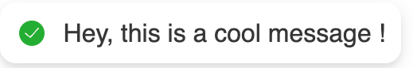
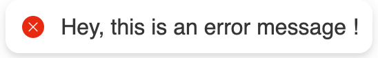
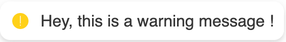
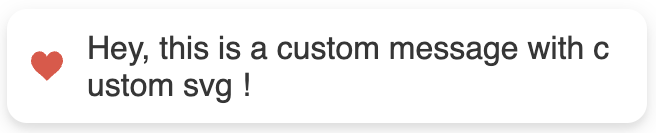
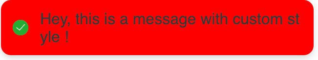
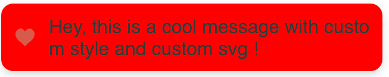

# Popup Notification System

This is a simple JavaScript library for displaying popup notifications on web pages.

## Features

- Display different types of notifications: default, error, warning, and custom.
- Customizable styles for notifications.
- Supports custom SVG icons for notifications.

## [Demo](https://crabii.cloud/)


## Installation

To use this library, you can directly include the JavaScript file in your HTML:

```html
<script src="popup.js"></script>
```

Alternatively, you can use it via cdn:
```html
<script src="https://cdn.crabii.cloud/cdns/popup.js"></script>
```

## Usage
First, create an instance of the Popup class:

```javascript
const popup = new Popup();
````

### Display Notifications
You can display notifications using the following methods:

#### Default Notification

```javascript
popup.message('This is a default message.', 3000, 'top');
```

#### Default Notification

```javascript
popup.message('This is a default message.', 3000, 'top');
```

#### Error Notification

```javascript
popup.message('This is a default message.', 3000, 'top');
```

#### Warning Notification

```javascript
popup.warn('This is a warning message.', 3000, 'top');
```

#### Custom Notification

```javascript
const customSvg = '<svg>...</svg>';
popup.custom('Custom message with custom SVG.', 3000, customSvg, 'top');
```

### Custom Styles
You can customize the style of notifications by passing an object with CSS properties:

```javascript
popup.message('Custom styled message.', 3000, 'top', { backgroundColor: 'red', color: 'white' });
````

### Custom SVG Icons

You can use custom SVG icons for notifications:

```javascript
const customSvg = '<svg>...</svg>';
popup.custom('Custom message with custom SVG.', 3000, customSvg, 'top');
```

### Custom SVG Icons and Custom Styles

You can use custom SVG and Style for notifications:

```javascript
const customSvg = '<svg>...</svg>';
popup.custom('Custom message with custom SVG.', 3000, customSvg, 'top', { backgroundColor: 'red', color: 'white' });
```

## Positioning

You can specify the position og the notification by using 'ltop', 'top', 'rtop'.


## Screenshots














## License

This project is licensed under the MIT License - see the [LICENSE](LICENCE.txt) file for details.